<p align="center">
  <picture>
    <source media="(prefers-color-scheme: dark)" srcset="docs/brand/mikudo-logo-dark.png">
    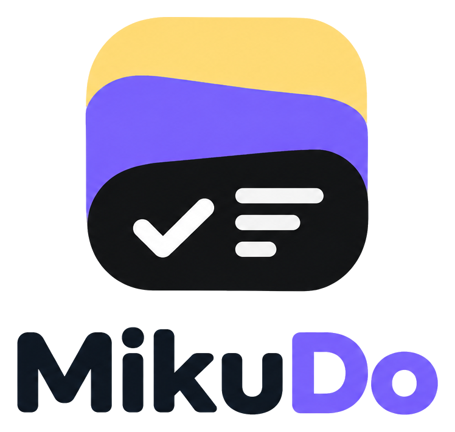
  </picture>
</p>

<p align="center">
  <b>Tasks, boards and Markdown notes in one fast Windows app.</b><br>
  Keyboard first, good-looking, and private: your data and the AI stay on your PC.
</p>

<p align="center">
  
  
  
  
</p>

<p align="center">
  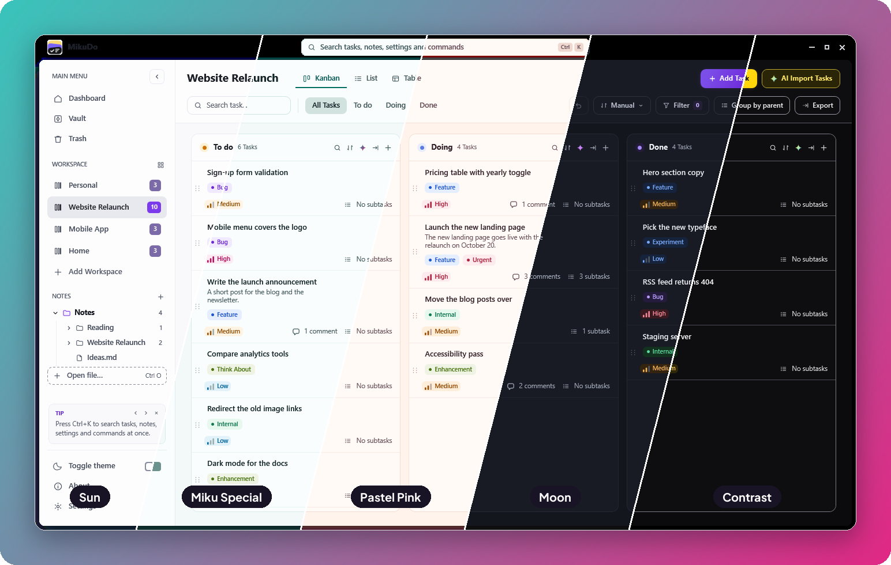
</p>

<p align="center">
  <a href="#features">Features</a> ·
  <a href="#notes">Notes</a> ·
  <a href="#ai">AI</a> ·
  <a href="#customizations">Customizations</a> ·
  <a href="#getting-started">Getting started</a>
</p>

---

## Features

<p align="center">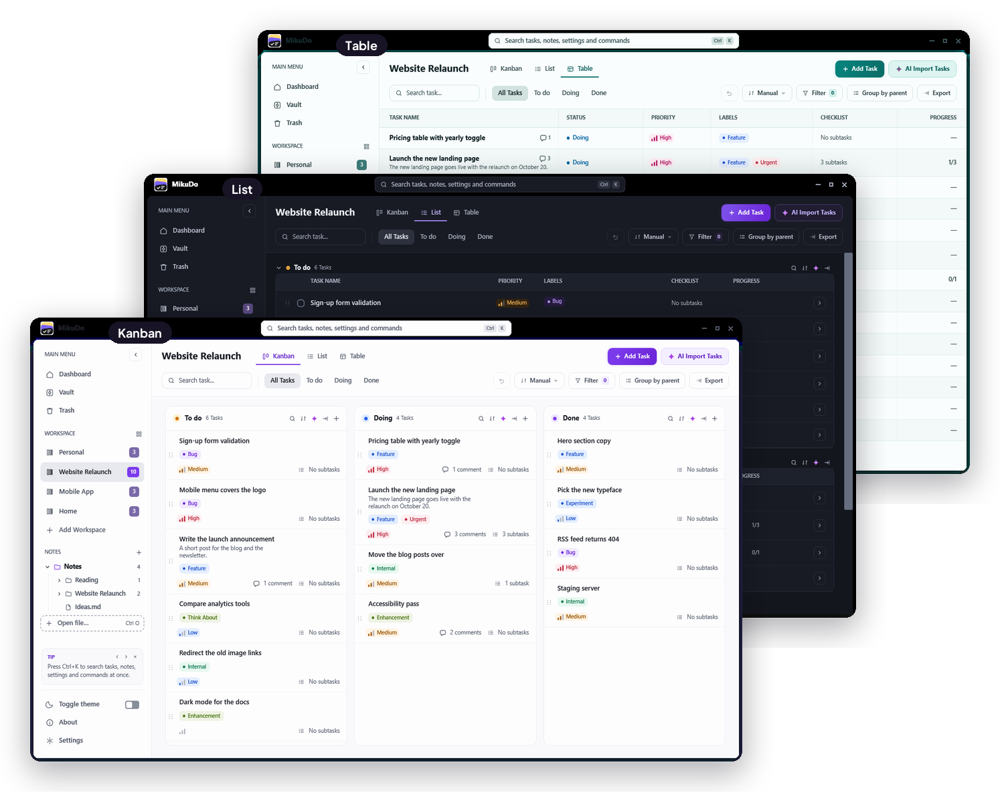</p>

**One board, three ways: Kanban, List and Table.** Drag cards between lists, drop one by another to make it a subtask, group subtasks under their parent, and <kbd>Ctrl</kbd>+click to change several cards at once.

<table>
  <tr>
    <td width="50%" valign="top">
      <b>Task pages</b><br>
      <sub>Live Markdown with tables, code and Mermaid diagrams; images, voice memos, files and comments. Select checklist lines and they become subtasks.</sub>
    </td>
    <td width="50%" valign="top">
      <b>Quick Access · <kbd>Ctrl</kbd>+<kbd>K</kbd></b><br>
      <sub>Every task, note, setting and command, and the words inside them. <code>#</code> tasks, <code>&gt;</code> commands, <code>n:</code> notes, <code>?</code> settings.</sub>
    </td>
  </tr>
  <tr>
    <td>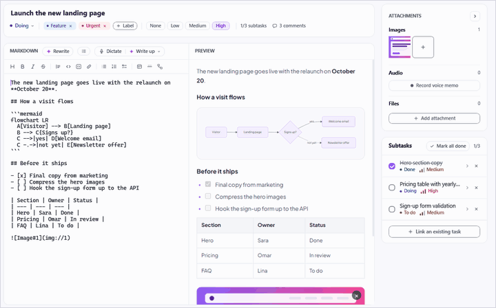</td>
    <td>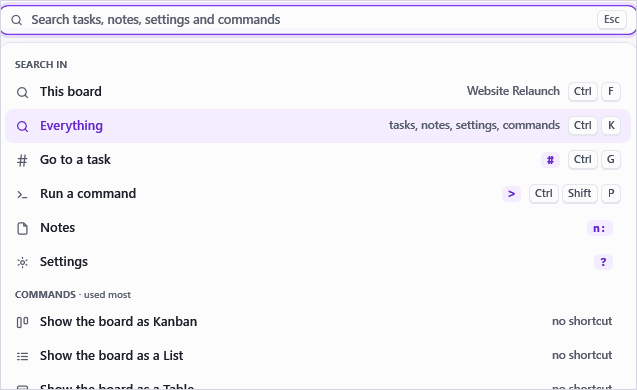</td>
  </tr>
  <tr>
    <td width="50%" valign="top">
      <b>Dashboard</b><br>
      <sub>What's open, what's moving and what needs attention, across every workspace or one.</sub>
    </td>
    <td width="50%" valign="top">
      <b>And more</b>
    </td>
  </tr>
  <tr>
    <td>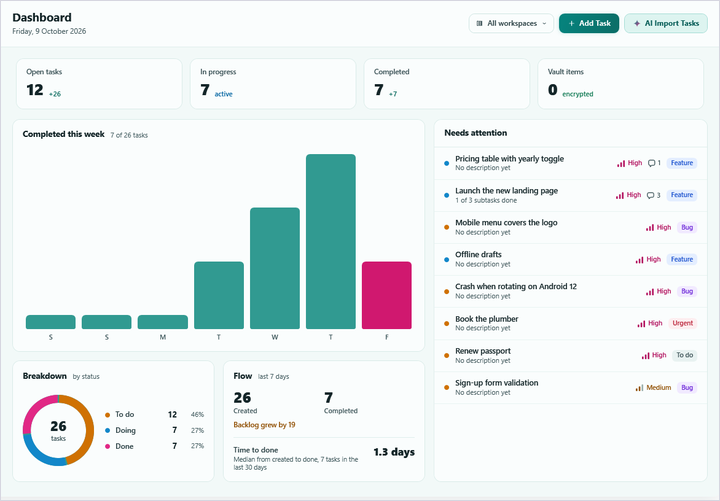</td>
    <td valign="top">
      <ul>
        <li><b>Vault</b>: tasks behind a password, encrypted with AES (key from PBKDF2-SHA256).</li>
        <li><b>Trash</b> and <b>Undo</b> for moves, renames, priorities, links and deletes.</li>
        <li><b>Export</b> a board or a list to Markdown.</li>
        <li><b>Screenshots</b> straight into a task; images pasted with <kbd>Ctrl</kbd>+<kbd>V</kbd>.</li>
        <li><b>Auto Save</b> and backups.</li>
      </ul>
    </td>
  </tr>
</table>

---

## Notes

MikuDo is a Markdown notes reader too. Point it at your folders and it keeps up with them.

<table>
  <tr>
    <td width="50%" valign="top">
      <b>Your folders, your files</b><br>
      <sub>Add folders under NOTES and every <code>.md</code> inside is found, subfolders too; files saved by other apps appear on their own. Make new notes in any folder, and hide the ones you don't need without moving a file.</sub>
    </td>
    <td width="50%" valign="top">
      <b>From notes to tasks</b><br>
      <sub>Make tasks turns a note's checklist into tasks on any board: nested items become subtasks, ticked ones land in Done, and each task links back to its note.</sub>
    </td>
  </tr>
  <tr>
    <td>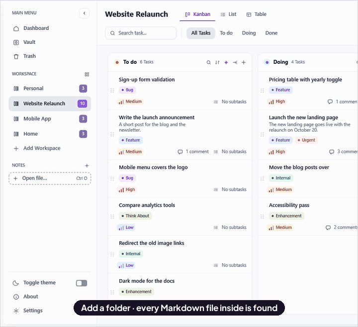</td>
    <td>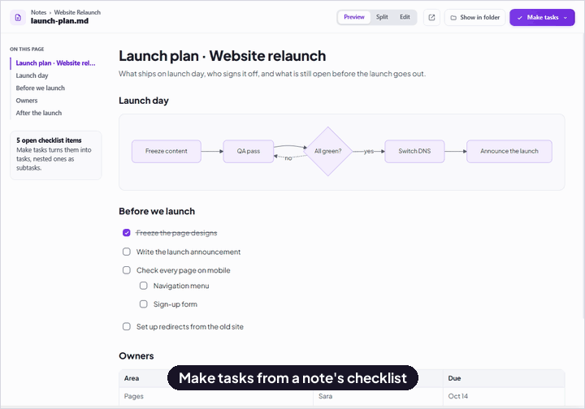</td>
  </tr>
  <tr>
    <td width="50%" valign="top">
      <b>Read and write</b><br>
      <sub>An outline beside the page; Edit, Split or Preview with live Mermaid diagrams; reader windows that can stay on top; <code>.md</code> files open in MikuDo straight from Explorer.</sub>
    </td>
    <td width="50%" valign="top">
      <b>Find · <kbd>Ctrl</kbd>+<kbd>F</kbd></b><br>
      <sub>Every match highlighted in a note or a task, with next and previous, match case, whole words and regex.</sub>
    </td>
  </tr>
  <tr>
    <td>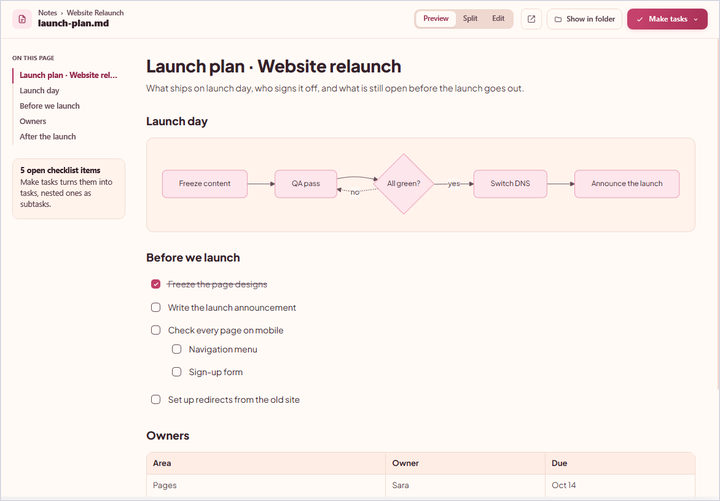</td>
    <td>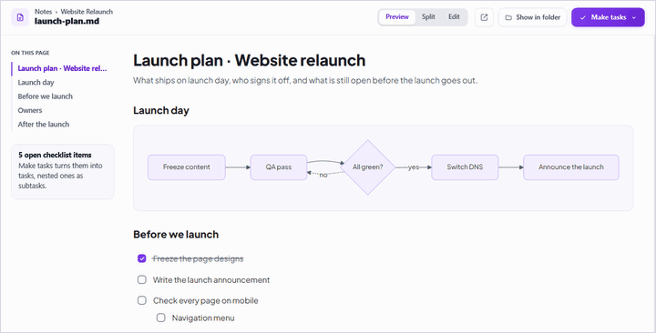</td>
  </tr>
</table>

---

## AI

Small open models that run on your own PC. Download them once in Settings; nothing you write or say leaves your computer.

<table>
  <tr>
    <td width="50%" valign="top"><b>AI Import</b><br><sub>Paste lines of work; get tasks with priority, labels and status.</sub></td>
    <td width="50%" valign="top"><b>Suggest labels</b><br><sub>Bug, Enhancement, Feature or Think About for the tasks you pick.</sub></td>
  </tr>
  <tr>
    <td>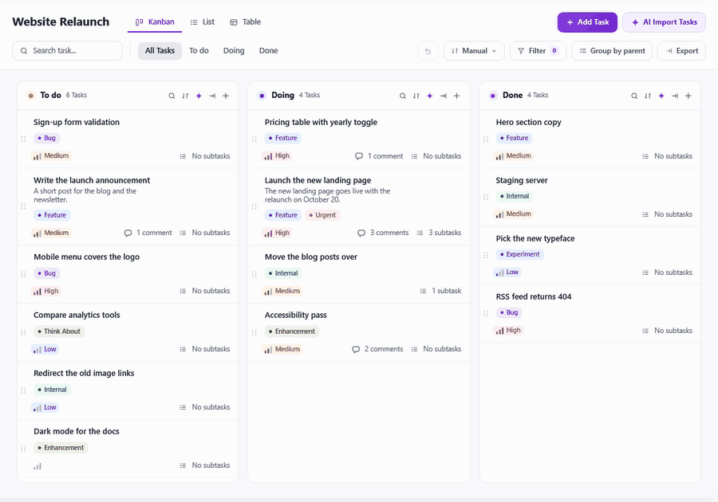</td>
    <td>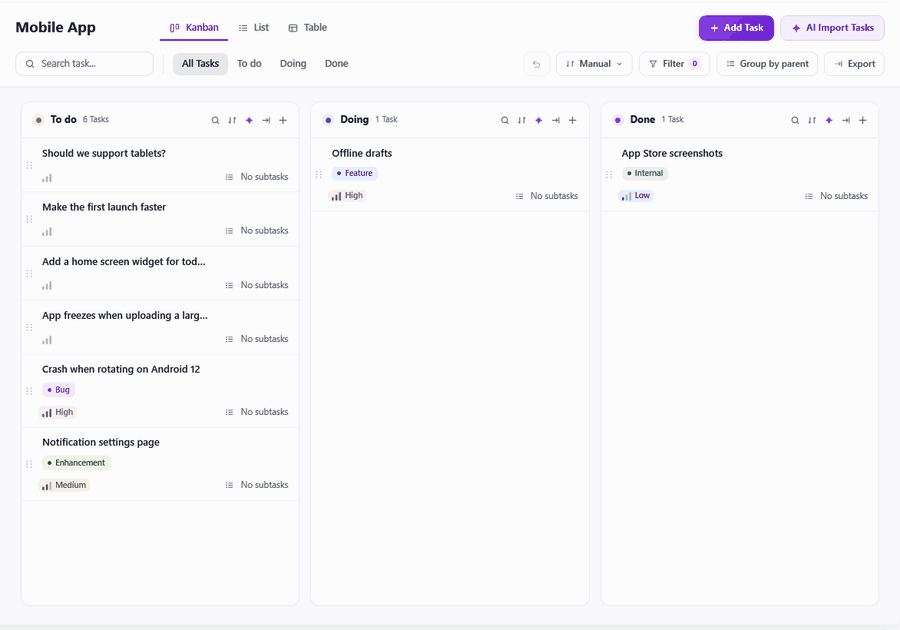</td>
  </tr>
  <tr>
    <td valign="top"><b>Rewrite</b><br><sub>Polish a description, or only the part you selected.</sub></td>
    <td valign="top"><b>Dictate</b><br><sub>Speak, and the words land in the description.</sub></td>
  </tr>
  <tr>
    <td>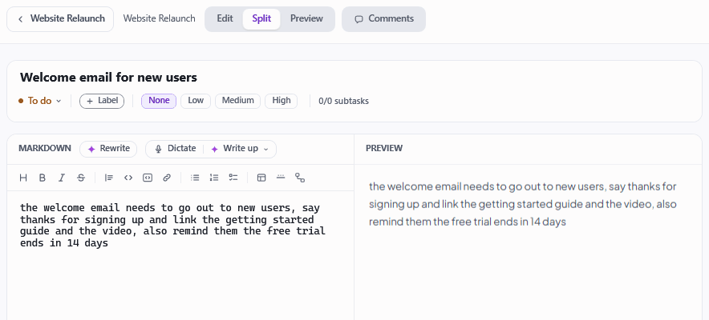</td>
    <td></td>
  </tr>
</table>

- **Language model:** Qwen2.5 0.5B by default (about 400 MB), or SmolLM2 135M as a lighter choice, run with LLamaSharp. Without one, AI Import still works with keyword rules, and `[x]` marks a task done.
- **Speech:** Whisper base.en (about 60 MB). Each task can dictate **Exact**, your words as spoken, or **Write up**, tidied into a description.
- Everything runs on the CPU: no account, no API key, no network after the download.

---

## Customizations

Five themes, **Sun**, **Moon**, **Miku Special**, **Pastel Pink** and **Contrast** (all of them at the top of this page), each in two layouts. Every theme is generated by [`tools/theme_studio.py`](tools/theme_studio.py), which checks every text and control colour against WCAG contrast targets (AA, and AAA in Contrast).

<table>
  <tr>
    <td width="50%" valign="top"><b>Islands or Flat</b><br><sub>Cards on a canvas, or edge to edge.</sub></td>
    <td width="50%" valign="top"><b>Your keys</b><br><sub>Give any command its own shortcut, or find one by pressing its keys. A key already in use says which command has it.</sub></td>
  </tr>
  <tr>
    <td>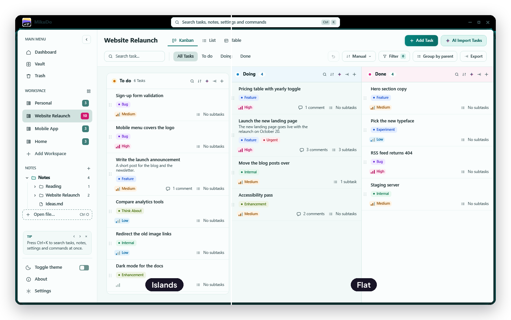</td>
    <td>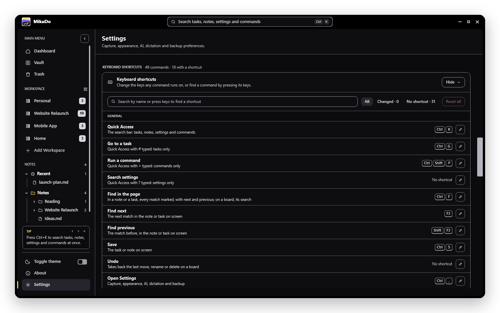</td>
  </tr>
</table>

Also yours to set: a sidebar GIF, Auto Save, the AI and speech models, and screenshots of one screen or all of them. Panel widths, the sidebar and how each board is sorted and grouped are remembered as you leave them.

---

## Getting started

You need Windows 10 or 11 (x64), the [.NET 9 SDK](https://dotnet.microsoft.com/download/dotnet/9.0), and the [WebView2 Runtime](https://developer.microsoft.com/microsoft-edge/webview2/) (already on most PCs).

```powershell
git clone <your-repo-url> MikuDo
cd MikuDo
dotnet run --project MikuDo
```

A single `MikuDo.exe` that runs without .NET installed:

```powershell
dotnet publish MikuDo -c Release -r win-x64 --self-contained true -p:PublishSingleFile=true -o publish
```

Your database, log and downloaded models live in `%LOCALAPPDATA%\Mikudo`; notes stay wherever you keep them.

```
MikuDo.sln
MikuDo/                 the app (.NET 9, WPF, MVVM)
  Views/ ViewModels/    pages, dialogs and the logic behind them
  Models/ Services/     data, storage, Markdown, AI, audio
  Controls/ Themes/     custom-drawn controls, generated themes, icons
  Assets/               app icon, logo, fonts, bundled Mermaid
tools/theme_studio.py   generates the five themes and checks their contrast
docs/brand/             the logo, the mark and the source artwork
docs/screenshots/       the pictures in this README
```

## Built with

[CommunityToolkit.Mvvm](https://github.com/CommunityToolkit/dotnet) ·
[LiteDB](https://www.litedb.org/) ·
[Markdig](https://github.com/xoofx/markdig) ·
[Mermaid](https://mermaid.js.org/) ·
[WebView2](https://developer.microsoft.com/microsoft-edge/webview2/) ·
[LLamaSharp](https://github.com/SciSharp/LLamaSharp) ·
[Whisper.net](https://github.com/sandrohanea/whisper.net) ·
[NAudio](https://github.com/naudio/NAudio) ·
[Plus Jakarta Sans](https://fonts.google.com/specimen/Plus+Jakarta+Sans)

<sub>The screenshots use made-up sample data. The AI recordings show real output from the local models.</sub>
